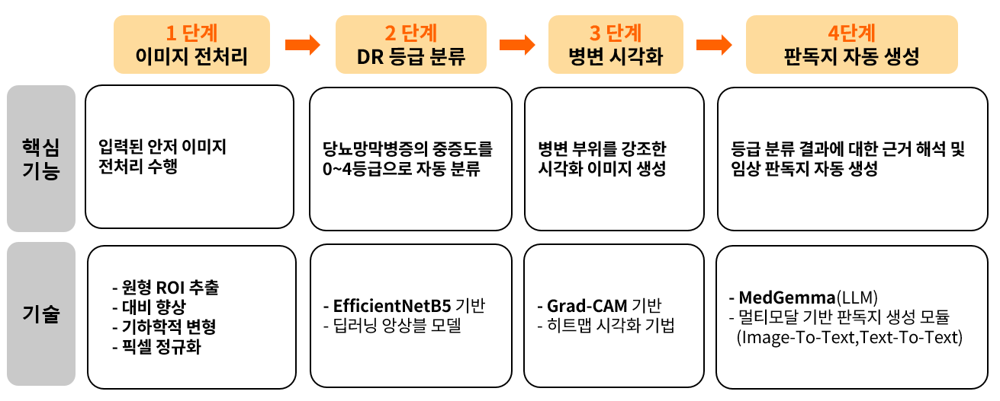
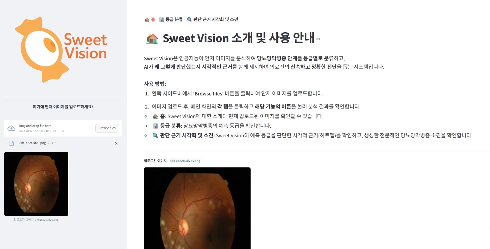
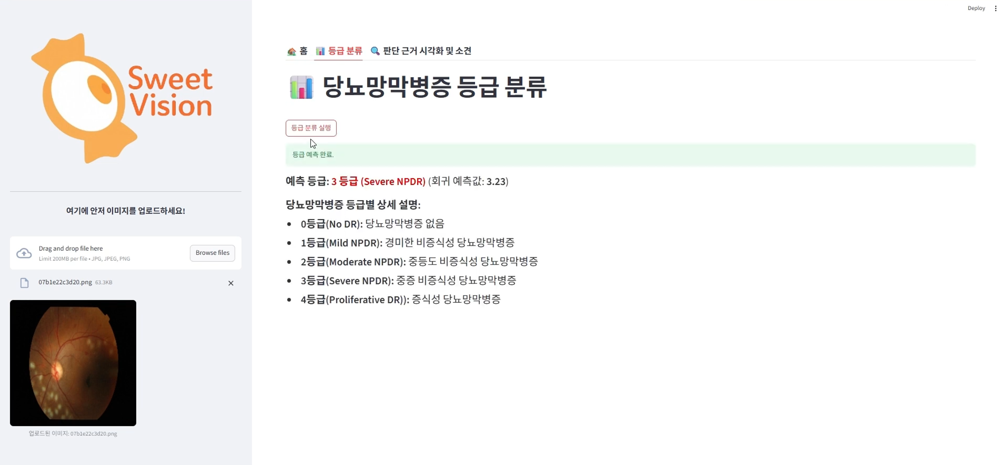
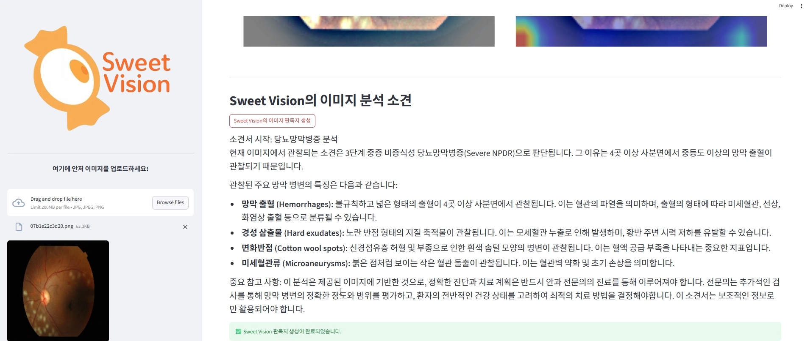

#  SweetVision: 딥러닝 기반 안저 영상 당뇨망막병증( DR ) 등급 분류 솔루션

  

**스위트비전(SweetVision)** 당뇨망막병증(DR) 조기 진단의 필요성과 전문의 판독 부담 문제를 해결하기 위해  
**EfficientNet 기반 CNN 분류 모델**, **Grad-CAM 시각화**, **MedGemma 멀티모달 LLM**을 결합하여  
안저 영상 자동 판독, 등급 분류, 임상 리포트를 제공하는 **AI 기반 디지털 헬스케어 솔루션**입니다. 

***

##  기술 스택

| 구분       | 사용 기술 |
|-----------|-----------|
| 언어       |  |
| 딥러닝 모델 |   |
| XAI        |  |
| LLM 연동   |  |
| 프레임워크/플랫폼 |  |
| 데이터 처리 |    |

***

##  시스템 아키텍처

***

##  주요 기능

### 1. 안저 이미지 입력 & 전처리
> **안구 ROI 추출, Ben Graham 기법**으로 병변 특징 강조 → 데이터 증강·정규화 후 모델 입력

| **입력 & 전처리** |
|-------------------|
|  |

### 2. DR 등급 분류 (0~4단계)
> **EfficientNet-B5 기반 CNN 모델**로 당뇨망막병증 등급 자동 분류 (Kappa score 0.92 달성)

| **등급 분류** |
|---------------|
|  |

### 3. 설명 가능한 AI (XAI) 시각화
> **Grad-CAM**으로 모델이 주목한 병변 위치를 히트맵으로 시각화, 판독 신뢰도 확보

| **XAI 시각화** |
|----------------|
|  |

### 4. 임상 판독지 자동 생성
> **MedGemma 멀티모달 LLM**으로 시각화 이미지 + 예측 결과 기반 임상 수준 판독지 자동 생성

| **임상 리포트 생성** |
|----------------------|
|  |

##  핵심 기여
- **데이터 전처리**: ROI 추출, Ben Graham 대비 강화, 증강 파이프라인 설계  
- **모델 개발**: EfficientNet-B5 기반 DR 등급 분류 (Kappa 0.92)
- **XAI + LLM 통합**: Grad-CAM 시각화와 MedGemma 기반 프롬프트 설계로 임상적 판독 리포트 자동 생성  

---

##  폴더 구조 (주요)

<pre>
📂 /
┣ 📜 run.py # 메인 실행 엔트리(학습/추론/데모 구동)
┣ 📜 config.py # 경로, 하이퍼파라미터, 모델/데이터 환경 설정
┣ 📜 preprocessing.py # OpenCV 기반 전처리(ROI 추출, Ben Graham, 정규화/증강)
┣ 📜 model.py # EfficientNet-B5 모델 정의 및 로더
┣ 📜 03_modeling.py # 학습/평가 파이프라인(학습 루프, 검증, 저장)
┣ 📜 xai_analysis.py # Grad-CAM 등 XAI 시각화 모듈
┣ 📜 llm_integration.py # MedGemma 등 LLM 연동(소견/판독 리포트 생성)
</pre>
